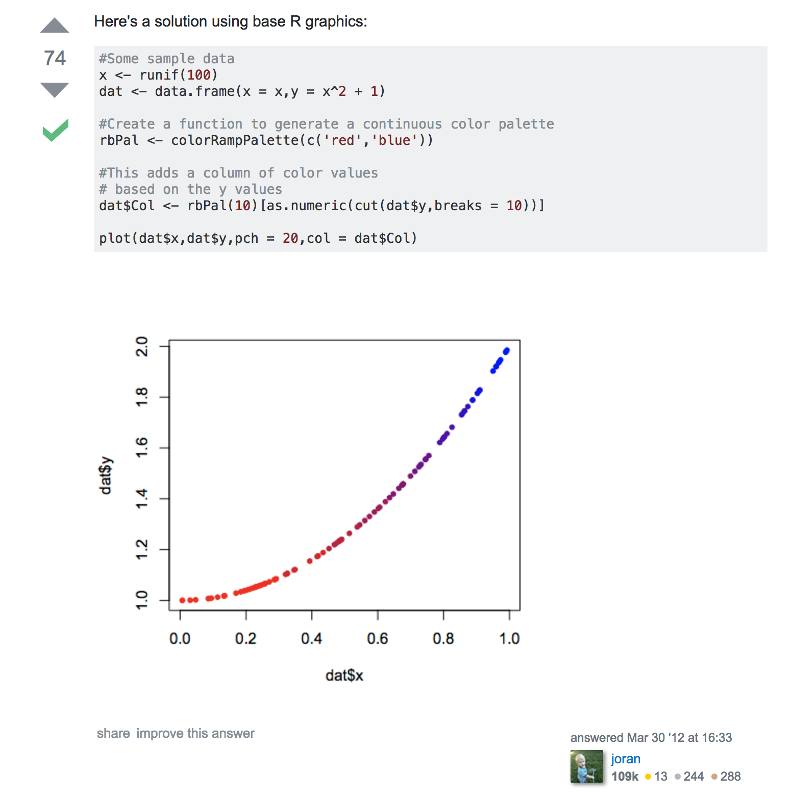

<style type="text/css">

h2 { /* Header 2 */
    font-size: 36px;
  color: DarkRed;
}
h3 { /* Header 3 */
  font-size: 30px;
  font-family: "Times New Roman", Times, serif;
  color: DarkBlue;
}
code.r{ /* Code block */
    font-size: 12px;
}
pre { /* Code block - determines code spacing between lines */
    font-size: 14px;
}
.reveal h1, .reveal h2, .reveal h3 {
  word-wrap: normal;
  -moz-hyphens: none;
}
p {
  font-family: "Helvetica", Arial, sans-serif;
}
h1, h2, h3 {
  font-family: "Helvetica", Arial, sans-serif;
}

</style>

```{r setup, include=FALSE}
knitr::opts_chunk$set(echo = FALSE, fig.align='center')
library(tidyverse)
```


## Copypasta

Code copied and pasted

```{r, out.width = "500px"}
knitr::include_graphics("https://upload.wikimedia.org/wikipedia/commons/d/d9/Espagueti_de_Pasta_Fresca_al_Huevo.jpg")
```


Espagueti de Pasta Fresca al Huevo, Javier Lastras from España/Spain CC BY 2.0, via Wikimedia Commons


## Code from the Internet

```{r, out.width = "400px"}

```

http://stackoverflow.com/questions/9946630/colour-points-in-a-plot-differently-depending-on-a-vector-of-values


## Your own code


```{r, out.width = "600px"}
knitr::include_graphics("http://i2.kym-cdn.com/photos/images/original/000/327/827/43a.jpg")
```


## What does it look like?

```{r, eval = FALSE, echo = TRUE}
MPB$"1994mpb" <- ifelse(MPB$"1994">0, 1994, 0)
MPB$"1995mpb" <- ifelse(MPB$"1995">0, 1995, 0)
MPB$"1996mpb" <- ifelse(MPB$"1996">0, 1996, 0)
MPB$"1997mpb" <- ifelse(MPB$"1997">0, 1997, 0)
MPB$"1998mpb" <- ifelse(MPB$"1998">0, 1998, 0)
MPB$"1999mpb" <- ifelse(MPB$"1999">0, 1999, 0)
MPB$"2000mpb" <- ifelse(MPB$"2000">0, 2000, 0)
MPB$"2001mpb" <- ifelse(MPB$"2001">0, 2001, 0)
MPB$"2002mpb" <- ifelse(MPB$"2002">0, 2002, 0)
MPB$"2003mpb" <- ifelse(MPB$"2003">0, 2003, 0)
MPB$"2004mpb" <- ifelse(MPB$"2004">0, 2004, 0)
MPB$"2005mpb" <- ifelse(MPB$"2005">0, 2005, 0)
MPB$"2006mpb" <- ifelse(MPB$"2006">0, 2006, 0)
MPB$"2007mpb" <- ifelse(MPB$"2007">0, 2007, 0)
MPB$"2008mpb" <- ifelse(MPB$"2008">0, 2008, 0)
MPB$"2009mpb" <- ifelse(MPB$"2009">0, 2009, 0)
MPB$"2010mpb" <- ifelse(MPB$"2010">0, 2010, 0)
MPB$"2011mpb" <- ifelse(MPB$"2011">0, 2011, 0)
MPB$"2012mpb" <- ifelse(MPB$"2012">0, 2012, 0)
MPB$"2013mpb" <- ifelse(MPB$"2013">0, 2013, 0)
MPB$"2014mpb" <- ifelse(MPB$"2014">0, 2014, 0)
MPB$"2015mpb" <- ifelse(MPB$"2015">0, 2015, 0)
```


## Roadmap

### 1. *Style concerns*
### 2. Technical debt
### 3. Solutions

## Readability

```{r, out.width = "500px"}
knitr::include_graphics("https://upload.wikimedia.org/wikipedia/commons/0/0d/Reading-books.jpg")
```

By Omarfaruquepro [CC BY-SA 4.0](http://creativecommons.org/licenses/by-sa/4.0), via Wikimedia Commons

## Code smell

```{r, out.width = "300px"}
knitr::include_graphics("https://upload.wikimedia.org/wikipedia/commons/thumb/2/29/A_gardener_smelling_a_flower%3B_representing_the_sense_of_smel_Wellcome_V0007698.jpg/629px-A_gardener_smelling_a_flower%3B_representing_the_sense_of_smel_Wellcome_V0007698.jpg")
```


## Code smell

- **duplicated code**
- contrived complexity
- feature envy
- innappropriate intimacy
- lazy class
- too many parameters
- excessively long identifiers
- excessively short identifiers

More at https://en.wikipedia.org/wiki/Code_smell


## Violation of DRY principle

### Do not repeat yourself

Every piece of knowledge must have a single, unambiguous, authoritative representation within a system

**Also see: WET code**

- "write everything twice"
- "we enjoy typing"
- "waste everyone's time"


## Exception to the DRY principle

**DAMP** unit tests: **D**escriptive **a**nd **m**eaningful **p**hrases

Readability over concision 

```{r, eval = FALSE, echo = TRUE}
test_that("invalid output directories cause errors", {
    files <- find_smap(id = "SPL3SMP", dates = "2015-03-31", version = 4)
    expect_error(download_smap(files[1, ], dir = 1234))
})

test_that("non-existent directories are created", {
    files <- find_smap(id = "SPL3SMP", dates = "2015-03-31", version = 4)
    dir_name <- "nonexistent_directory"
    downloads <- download_smap(files, directory = dir_name)
    expect_true(dir.exists(dir_name))
    unlink(dir_name, recursive = TRUE)
})
```


## Technical debt

**Easy** to implement short term

**Hard** to maintain or extend long term


## Modifying code with technical debt

Add `conf.level = 0.99` to all 150 `t-test()` function calls:

```{r, echo = TRUE, eval = FALSE}
t.test(forest$VCF_before_fire, forest$VCF_since_fire0, paired=TRUE, na.action="na.pass")
t.test(forest$VCF_before_fire, forest$VCF_since_fire1, paired=TRUE, na.action="na.pass")
t.test(forest$VCF_before_fire, forest$VCF_since_fire2, paired=TRUE, na.action="na.pass")
t.test(forest$VCF_before_fire, forest$VCF_since_fire3, paired=TRUE, na.action="na.pass")
t.test(forest$VCF_before_fire, forest$VCF_since_fire4, paired=TRUE, na.action="na.pass")
t.test(forest$VCF_before_fire, forest$VCF_since_fire5, paired=TRUE, na.action="na.pass")
t.test(forest$VCF_before_fire, forest$VCF_since_fire6, paired=TRUE, na.action="na.pass")
t.test(forest$VCF_before_fire, forest$VCF_since_fire7, paired=TRUE, na.action="na.pass")
t.test(forest$VCF_before_fire, forest$VCF_since_fire8, paired=TRUE, na.action="na.pass")
t.test(forest$VCF_before_fire, forest$VCF_since_fire9, paired=TRUE, na.action="na.pass")
t.test(forest$VCF_before_fire, forest$VCF_since_fire10, paired=TRUE, na.action="na.pass")
t.test(forest$VCF_before_fire, forest$VCF_since_fire11, paired=TRUE, na.action="na.pass")
t.test(forest$VCF_before_fire, forest$VCF_since_fire12, paired=TRUE, na.action="na.pass")
t.test(forest$VCF_before_fire, forest$VCF_since_fire13, paired=TRUE, na.action="na.pass")
t.test(forest$VCF_before_fire, forest$VCF_since_fire14, paired=TRUE, na.action="na.pass")
```


## Extending code with technical debt

```{r, eval = FALSE, echo = TRUE}
# Data associated with this code:
fish_pts_SR2.txt
fish_pts_SR3.txt
fish_pts_SR4.txt
fish_pts_SR5.txt

setwd("/Users/megancattau/Dropbox/0_EarthLab/Disturbance")
setwd("/Users/meca3122/Dropbox/0_EarthLab/Disturbance")
getwd()
```


## Technical debt

### Accruing interest

Over time, technical debt increases


## Technical debt

### Accruing interest

Over time, technical debt increases

### Months later

Do you remember what your uncommented sections do?


## Technical debt

### Accruing interest

Over time, technical debt increases

### Months later

Do you remember what your uncommented sections do?

### After getting reviews back

Can you efficiently revise your code $N$ months for resubmission?


## Technical debt

### Accruing interest

Over time, technical debt increases

### Months later

Do you remember what your uncommented sections do?

### After getting reviews back

Can you efficiently revise your code $N$ months for resubmission?

### Once the paper is out

Is your code useful to anyone else, or do they inherit your debt?


## Technical debt

### Error proneness

```java
inline Vector3int32& operator+=(const Vector3int32& other) {
  x += other.x;
  y += other.y;
  z += other.y;
  return *this;
}
```

## The last line effect (Karpov 2014)

Errors are **4X** more likely in last line

```
inline void Init( float ix=0, float iy=0,
                  float iz=0, float iw = 0 ) 
{
  SetX( ix );
  SetY( iy );
  SetZ( iz );
  SetZ( iw );
}
```


https://www.viva64.com/en/b/0260/


## Solutions for copypasta

### 1. Refactoring


## Common strategies for refactoring

### Functions

- **function** performs task
- **arguments** specify what differs

### Iteration

- use loops, apply, list-comprehension, etc. to call your function

```{r, out.width = "300px"}
knitr::include_graphics("https://upload.wikimedia.org/wikipedia/commons/9/92/Duplicate_code.gif")
```


By Bokanko (Own work) [CC BY-SA 3.0](http://creativecommons.org/licenses/by-sa/3.0), via Wikimedia Commons


## In situ example of refactoring

https://github.com/mbjoseph/code-style/commit/c9a66da37d02645567bc2e9b51373bf43adbd97f
